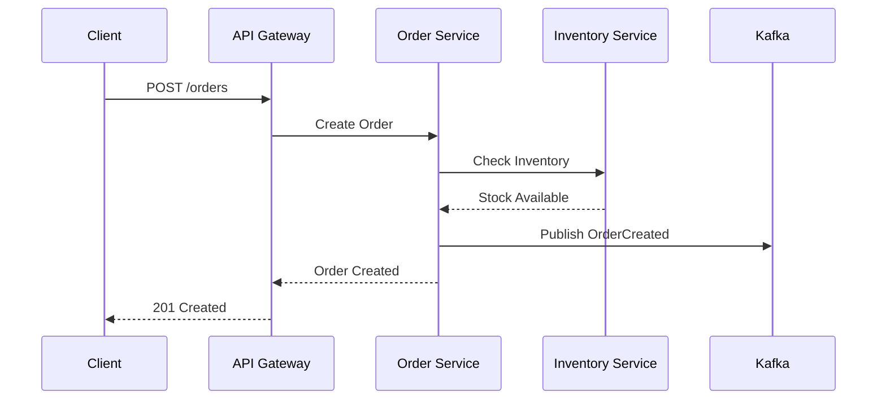
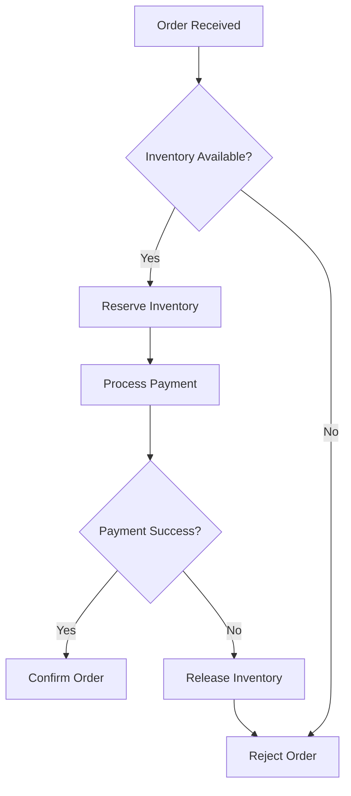
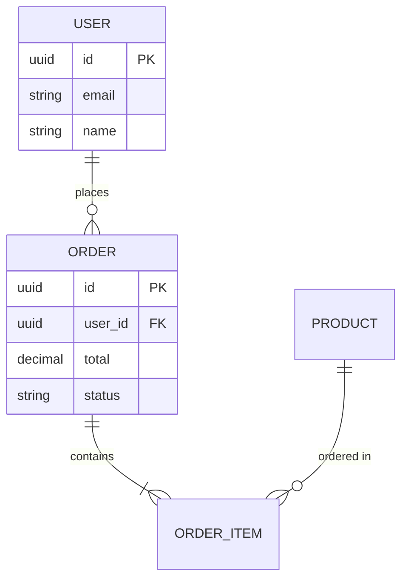
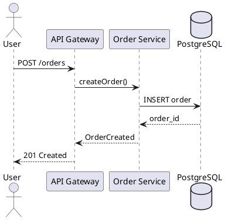

# Documentation & Architecture Diagramming Guide

> **Your Goal:** Build the habit of documenting decisions and creating clear architecture diagrams
> **Time Investment:** 30 mins/week initially → becomes second nature

---

## 🧠 Why You Don't Document (And How to Fix It)

### Common Blockers

| Excuse | Reality | Fix |
|--------|---------|-----|
| "No time" | Takes 15-30 mins | Schedule it like a meeting |
| "I'll remember" | You won't. Neither will others. | Write it now, thank yourself later |
| "It's obvious" | Only to you, only today | Future team members need context |
| "It will change" | That's fine. Update it. | Outdated docs > no docs |
| "I don't know the format" | Use templates below | Copy-paste and fill |

### The Mindset Shift

> **Before:** "I finished the feature" ✅
> **After:** "I finished the feature AND documented the decision" ✅✅

---

## 📝 PART 1: Documentation Templates

---

## 1. Architecture Decision Record (ADR)

**When to write:** Every significant technical decision

### Template

```markdown
# ADR-001: [Short Title]

## Status
[Proposed | Accepted | Deprecated | Superseded by ADR-XXX]

## Date
YYYY-MM-DD

## Context
What is the issue that we're seeing that is motivating this decision?
What are the constraints?

## Decision
What is the change that we're proposing and/or doing?

## Options Considered

### Option 1: [Name]
- **Pros:** 
- **Cons:** 
- **Estimated Effort:** 

### Option 2: [Name]
- **Pros:** 
- **Cons:** 
- **Estimated Effort:** 

### Option 3: [Name]
- **Pros:** 
- **Cons:** 
- **Estimated Effort:** 

## Decision Rationale
Why did we choose this option over others?

## Consequences
What becomes easier or more difficult because of this decision?

### Positive
- 

### Negative
- 

### Risks
- 

## References
- [Link to relevant docs]
- [Link to discussion]
```

### Real Example: ADR

```markdown
# ADR-003: Use PostgreSQL for Primary Database

## Status
Accepted

## Date
2024-01-15

## Context
We need to choose a primary database for our e-commerce platform.
Requirements:
- ACID transactions for orders and payments
- Complex queries for reporting
- Expected scale: 10M users, 1M orders/month
- Team has SQL experience

## Decision
We will use PostgreSQL (via AWS RDS) as our primary database.

## Options Considered

### Option 1: PostgreSQL
- **Pros:** ACID, mature, great tooling, team knows SQL, JSON support
- **Cons:** Horizontal scaling requires planning
- **Estimated Effort:** Low (team familiar)

### Option 2: MongoDB
- **Pros:** Flexible schema, easy horizontal scaling
- **Cons:** No ACID transactions (until recent versions), team unfamiliar
- **Estimated Effort:** Medium (learning curve)

### Option 3: DynamoDB
- **Pros:** Serverless, auto-scaling, AWS native
- **Cons:** Limited query flexibility, expensive at scale, learning curve
- **Estimated Effort:** High (paradigm shift)

## Decision Rationale
- ACID transactions are critical for orders/payments
- Team productivity higher with familiar tech
- PostgreSQL scales to our needs with proper design
- Can add read replicas for reporting workloads

## Consequences

### Positive
- Strong data consistency
- Complex queries supported
- Lower learning curve

### Negative
- Need to plan for scaling (partitioning, read replicas)
- Single point of failure (mitigated by Multi-AZ)

### Risks
- Schema migrations need careful planning
- Connection pooling required at scale
```

---

## 2. Technical Design Document

**When to write:** New features, major changes, system integrations

### Template

```markdown
# Technical Design: [Feature Name]

## Overview
Brief description of what we're building and why.

## Goals
- Goal 1
- Goal 2

## Non-Goals
- What we're explicitly NOT doing

## Background
Context and any prior art or existing systems.

## Proposed Solution

### High-Level Design
[Architecture diagram here]

### Detailed Design

#### Component 1: [Name]
- Responsibility
- Interfaces
- Data flow

#### Component 2: [Name]
- Responsibility
- Interfaces
- Data flow

### API Design
```
POST /api/v1/orders
Request: { ... }
Response: { ... }
```

### Data Model
```sql
CREATE TABLE orders (
  id UUID PRIMARY KEY,
  ...
);
```

### Sequence Diagram
[Diagram showing flow]

## Alternatives Considered
Why we rejected other approaches.

## Security Considerations
- Authentication
- Authorization
- Data protection

## Operational Considerations
- Monitoring
- Alerting
- Rollback plan

## Testing Strategy
- Unit tests
- Integration tests
- Load tests

## Rollout Plan
- Phase 1: ...
- Phase 2: ...

## Open Questions
- Question 1?
- Question 2?

## References
- [Links]
```

---

## 3. Runbook / Operations Document

**When to write:** For any production service

### Template

```markdown
# Runbook: [Service Name]

## Service Overview
What does this service do?

## Architecture
[Simple diagram]

## Dependencies
| Service | Type | Failure Impact |
|---------|------|----------------|
| PostgreSQL | Database | Critical - service down |
| Redis | Cache | Degraded - slower response |
| Kafka | Messaging | Degraded - async failures |

## Health Checks
- **Endpoint:** GET /health
- **Expected Response:** 200 OK

## Key Metrics
| Metric | Normal Range | Alert Threshold |
|--------|--------------|-----------------|
| Request latency (p99) | < 200ms | > 500ms |
| Error rate | < 0.1% | > 1% |
| CPU usage | < 60% | > 80% |

## Common Issues & Solutions

### Issue 1: High Latency
**Symptoms:** Response time > 500ms
**Possible Causes:**
1. Database slow queries
2. Cache miss rate high
3. Downstream service slow

**Resolution Steps:**
1. Check database metrics in Grafana
2. Check cache hit rate
3. Check downstream service health

### Issue 2: Connection Errors
**Symptoms:** "Connection refused" in logs
**Resolution Steps:**
1. Check database connectivity
2. Verify security groups
3. Check connection pool exhaustion

## Deployment
```bash
# Deploy new version
kubectl apply -f deployment.yaml

# Rollback
kubectl rollout undo deployment/service-name
```

## Contacts
- **Team:** Platform Team
- **Slack:** #platform-support
- **PagerDuty:** platform-oncall
```

---

## 4. Postmortem Template

**When to write:** After any production incident

### Template

```markdown
# Postmortem: [Incident Title]

## Incident Summary
| Field | Value |
|-------|-------|
| Date | YYYY-MM-DD |
| Duration | X hours Y minutes |
| Severity | P1/P2/P3 |
| Impact | X users affected, Y orders failed |
| Root Cause | Brief description |

## Timeline (All times in UTC)
| Time | Event |
|------|-------|
| 14:00 | Alert triggered for high error rate |
| 14:05 | On-call engineer acknowledged |
| 14:15 | Root cause identified |
| 14:30 | Fix deployed |
| 14:35 | Services recovered |

## Root Cause Analysis
Detailed explanation of what went wrong.

## What Went Well
- Alert triggered quickly
- Team responded fast

## What Went Wrong
- Deployment lacked proper testing
- Runbook was outdated

## Action Items
| Action | Owner | Due Date | Status |
|--------|-------|----------|--------|
| Add integration test for X | @engineer1 | 2024-01-20 | Open |
| Update runbook | @engineer2 | 2024-01-18 | Done |
| Add monitoring for Y | @engineer1 | 2024-01-22 | Open |

## Lessons Learned
- Key insight 1
- Key insight 2
```

---

## 🎨 PART 2: Architecture Diagrams

---

## The C4 Model (Learn This First)

C4 = **Context, Containers, Components, Code**

It's a hierarchical approach: zoom in from high-level to detailed.

### Level 1: System Context Diagram
**Question:** What is my system and who uses it?

```
┌─────────────────────────────────────────────────────────────┐
│                                                             │
│    ┌──────────┐         ┌──────────────┐       ┌────────┐  │
│    │   User   │────────▶│  E-Commerce  │──────▶│ Payment│  │
│    │ (Person) │         │   System     │       │ Gateway│  │
│    └──────────┘         └──────────────┘       │(External)│ │
│                                │               └────────┘  │
│                                │                           │
│                                ▼                           │
│                         ┌──────────┐                       │
│                         │  Email   │                       │
│                         │ Service  │                       │
│                         │(External)│                       │
│                         └──────────┘                       │
│                                                             │
└─────────────────────────────────────────────────────────────┘
```

**Shows:** Users, your system (as a box), external systems

---

### Level 2: Container Diagram
**Question:** What are the major building blocks inside my system?

```
┌─────────────────────────────────────────────────────────────────────────┐
│                           E-Commerce System                              │
├─────────────────────────────────────────────────────────────────────────┤
│                                                                          │
│   ┌────────────┐      ┌────────────┐      ┌────────────┐                │
│   │  Web App   │      │ Mobile App │      │ Admin App  │                │
│   │  (React)   │      │   (React   │      │  (React)   │                │
│   │            │      │   Native)  │      │            │                │
│   └─────┬──────┘      └─────┬──────┘      └─────┬──────┘                │
│         │                   │                   │                        │
│         └───────────────────┼───────────────────┘                        │
│                             │                                            │
│                             ▼                                            │
│                    ┌────────────────┐                                    │
│                    │  API Gateway   │                                    │
│                    │   (Kong/AWS)   │                                    │
│                    └───────┬────────┘                                    │
│                            │                                             │
│         ┌──────────────────┼──────────────────┐                         │
│         │                  │                  │                         │
│         ▼                  ▼                  ▼                         │
│  ┌─────────────┐   ┌─────────────┐   ┌─────────────┐                   │
│  │ User Service│   │Order Service│   │Product Svc  │                   │
│  │  (NestJS)   │   │  (NestJS)   │   │  (NestJS)   │                   │
│  └──────┬──────┘   └──────┬──────┘   └──────┬──────┘                   │
│         │                 │                 │                           │
│         └─────────────────┼─────────────────┘                           │
│                           │                                             │
│              ┌────────────┴────────────┐                                │
│              ▼                         ▼                                │
│      ┌─────────────┐           ┌─────────────┐                         │
│      │ PostgreSQL  │           │    Redis    │                         │
│      │  (Database) │           │   (Cache)   │                         │
│      └─────────────┘           └─────────────┘                         │
│                                                                         │
└─────────────────────────────────────────────────────────────────────────┘
```

**Shows:** Apps, services, databases, message queues, external APIs

---

### Level 3: Component Diagram
**Question:** What are the major components inside a container?

```
┌─────────────────────────────────────────────────────────────────────────┐
│                         Order Service (NestJS)                           │
├─────────────────────────────────────────────────────────────────────────┤
│                                                                          │
│   ┌─────────────────┐                                                   │
│   │ OrderController │  ◄── REST API endpoints                           │
│   └────────┬────────┘                                                   │
│            │                                                            │
│            ▼                                                            │
│   ┌─────────────────┐     ┌─────────────────┐                          │
│   │  OrderService   │────▶│ InventoryClient │──▶ Inventory Service     │
│   │ (Business Logic)│     └─────────────────┘                          │
│   └────────┬────────┘                                                   │
│            │              ┌─────────────────┐                          │
│            ├─────────────▶│  PaymentClient  │──▶ Payment Gateway       │
│            │              └─────────────────┘                          │
│            │                                                            │
│            ▼              ┌─────────────────┐                          │
│   ┌─────────────────┐     │  KafkaProducer  │──▶ Kafka                 │
│   │OrderRepository  │     └─────────────────┘                          │
│   └────────┬────────┘                                                   │
│            │                                                            │
│            ▼                                                            │
│      PostgreSQL                                                         │
│                                                                          │
└─────────────────────────────────────────────────────────────────────────┘
```

**Shows:** Classes, modules, their responsibilities and interactions

---

### Level 4: Code Diagram
**Usually not needed** — IDE and code itself serves this purpose.

---

## 🛠️ Diagramming Tools (Ranked by Use Case)

---

### 1. **Excalidraw** ⭐ (Start Here)
**Best for:** Quick sketches, brainstorming, informal diagrams

| Aspect | Details |
|--------|---------|
| **URL** | https://excalidraw.com |
| **Cost** | Free |
| **Learning Time** | 5 minutes |
| **Style** | Hand-drawn, informal |
| **Export** | PNG, SVG |
| **Collaboration** | Real-time |

**When to use:**
- ✅ Quick architecture sketches
- ✅ Whiteboard-style diagrams
- ✅ Brainstorming sessions
- ❌ Formal documentation

**Pro tip:** There's a VS Code extension: `Excalidraw`

---

### 2. **Draw.io / Diagrams.net** ⭐⭐
**Best for:** Professional diagrams, AWS architectures

| Aspect | Details |
|--------|---------|
| **URL** | https://app.diagrams.net |
| **Cost** | Free |
| **Learning Time** | 30 minutes |
| **Style** | Professional, clean |
| **Export** | PNG, SVG, PDF, XML |
| **Collaboration** | Via Google Drive / OneDrive |

**When to use:**
- ✅ AWS architecture diagrams (has AWS icons built-in)
- ✅ Formal documentation
- ✅ Sequence diagrams
- ✅ Database schemas

**Pro tip:** 
- VS Code extension: `Draw.io Integration`
- Save as `.drawio.svg` for version control

**AWS Icons:** Built-in! Just search "AWS" in shapes.

---

### 3. **Mermaid** ⭐⭐⭐
**Best for:** Diagrams as code, version-controlled diagrams

| Aspect | Details |
|--------|---------|
| **URL** | https://mermaid.live |
| **Cost** | Free |
| **Learning Time** | 1 hour |
| **Style** | Clean, consistent |
| **Export** | PNG, SVG |
| **Collaboration** | Via Git (it's just text!) |

**When to use:**
- ✅ Diagrams in Markdown docs
- ✅ Sequence diagrams
- ✅ Flowcharts
- ✅ ER diagrams
- ✅ Version-controlled diagrams

**Example - Sequence Diagram:**


**Example - Flowchart:**


**Example - ER Diagram:**


**Pro tip:** GitHub, GitLab, Notion all render Mermaid natively!

---

### 4. **PlantUML**
**Best for:** Detailed UML diagrams, sequence diagrams

| Aspect | Details |
|--------|---------|
| **URL** | https://plantuml.com |
| **Cost** | Free |
| **Learning Time** | 2 hours |
| **Style** | UML standard |
| **Export** | PNG, SVG |

**Example:**


---

### 5. **Lucidchart** (Paid)
**Best for:** Enterprise, team collaboration

| Aspect | Details |
|--------|---------|
| **URL** | https://lucidchart.com |
| **Cost** | $7.95/month+ |
| **Learning Time** | 30 minutes |
| **Style** | Professional |
| **Collaboration** | Real-time, comments |

**When to use:**
- ✅ Team collaboration
- ✅ Stakeholder presentations
- ✅ Complex diagrams

---

### 6. **Figma** (For Beautiful Diagrams)
**Best for:** Marketing-quality architecture diagrams

| Aspect | Details |
|--------|---------|
| **URL** | https://figma.com |
| **Cost** | Free tier available |
| **Learning Time** | 2-3 hours |

**When to use:**
- ✅ Portfolio pieces
- ✅ Blog posts
- ✅ Presentations

---

## 🎯 Tool Recommendation by Situation

| Situation | Tool | Why |
|-----------|------|-----|
| Quick sketch in meeting | Excalidraw | Fast, intuitive |
| AWS architecture for docs | Draw.io | Has AWS icons |
| Diagram in README | Mermaid | Version controlled |
| Sequence diagram | Mermaid or PlantUML | Best for sequences |
| Database schema | Draw.io or Mermaid | ER diagram support |
| Portfolio/Blog | Figma or Draw.io | Professional look |
| Team collaboration | Lucidchart or Excalidraw | Real-time editing |

---

## 📅 30-Day Documentation Habit Builder

### Week 1: Get Started
| Day | Task | Time |
|-----|------|------|
| 1 | Install Draw.io VS Code extension | 5 min |
| 2 | Watch C4 model intro video | 15 min |
| 3 | Draw your current project's Context diagram | 20 min |
| 4 | Learn Mermaid basics | 20 min |
| 5 | Create a sequence diagram in Mermaid | 20 min |
| 6-7 | Practice: Draw Container diagram | 30 min |

### Week 2: Write Your First ADR
| Day | Task | Time |
|-----|------|------|
| 8 | Pick a past decision to document | 5 min |
| 9 | Write the ADR using template | 30 min |
| 10 | Add a diagram to your ADR | 20 min |
| 11 | Review and refine | 15 min |
| 12 | Write second ADR | 30 min |
| 13-14 | Practice: Third ADR | 30 min |

### Week 3: Technical Design Doc
| Day | Task | Time |
|-----|------|------|
| 15 | Pick a feature you built | 5 min |
| 16 | Write overview and goals | 20 min |
| 17 | Create architecture diagram | 30 min |
| 18 | Document API and data model | 30 min |
| 19 | Add sequence diagrams | 20 min |
| 20-21 | Review and complete | 30 min |

### Week 4: Build the Habit
| Day | Task | Time |
|-----|------|------|
| 22 | Set up ADR folder in your repo | 10 min |
| 23 | Create ADR template file | 10 min |
| 24 | Document one decision from this week | 20 min |
| 25 | Create runbook for a service | 30 min |
| 26 | Review all docs created | 20 min |
| 27-28 | Plan: Schedule weekly doc time | 10 min |

---

## 🏆 Your Documentation Checklist

After 30 days, you should have:

- [ ] 3+ ADRs written
- [ ] 1 Technical Design Document
- [ ] 1 System Context Diagram (C4 Level 1)
- [ ] 1 Container Diagram (C4 Level 2)
- [ ] 2+ Sequence Diagrams
- [ ] 1 Database ER Diagram
- [ ] 1 Runbook

---

## 💡 Pro Tips

### 1. Start Ugly
Your first diagrams will look bad. That's fine. Done > Perfect.

### 2. Time-box It
Set 30 minutes. When time's up, ship it.

### 3. Store in Repo
```
/docs
  /adr
    ADR-001-database-choice.md
    ADR-002-auth-strategy.md
  /architecture
    context-diagram.drawio.svg
    container-diagram.drawio.svg
  /runbooks
    order-service.md
```

### 4. Review Monthly
Set a calendar reminder to review and update docs.

### 5. Link Everything
- ADR references the diagram
- Diagram links to the code
- Runbook references the ADR

---

## 📚 Resources

### Videos
- [C4 Model Explained](https://www.youtube.com/watch?v=x2-rSnhpw0g) - Simon Brown
- [Mermaid Diagrams Tutorial](https://www.youtube.com/watch?v=JiQmpA474BY)

### Articles
- [ADR GitHub Examples](https://github.com/joelparkerhenderson/architecture-decision-record)
- [C4 Model Official](https://c4model.com/)

### Books
- "Documenting Software Architectures" - Bass, Clements, Kazman

---

## ✅ Action Items (Do This Now)

1. **Today:** Install Draw.io VS Code extension
2. **This Week:** Draw Context diagram of your current project
3. **This Week:** Write ONE ADR for a recent decision
4. **This Month:** Complete the 30-day habit builder

---

*The best time to document was when you made the decision. The second best time is now.*
